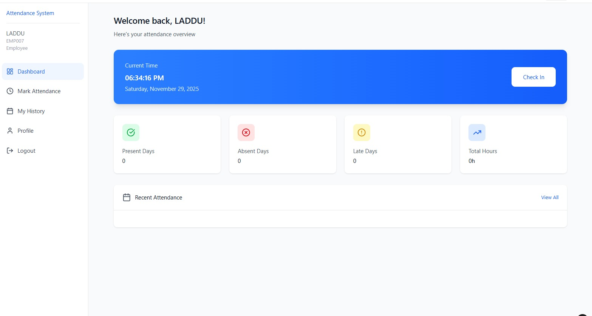
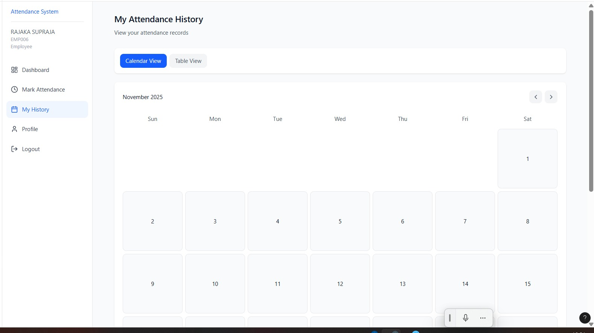
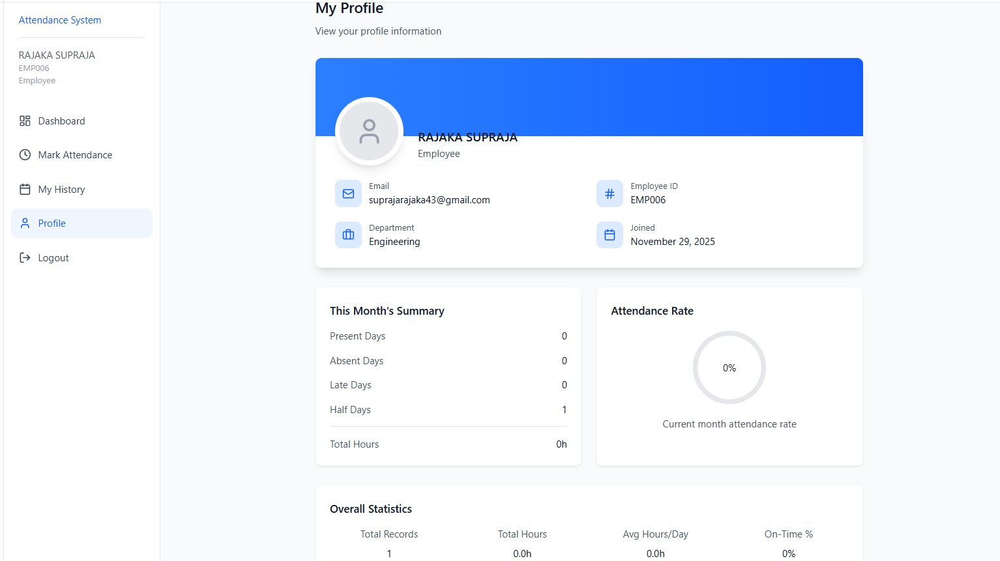
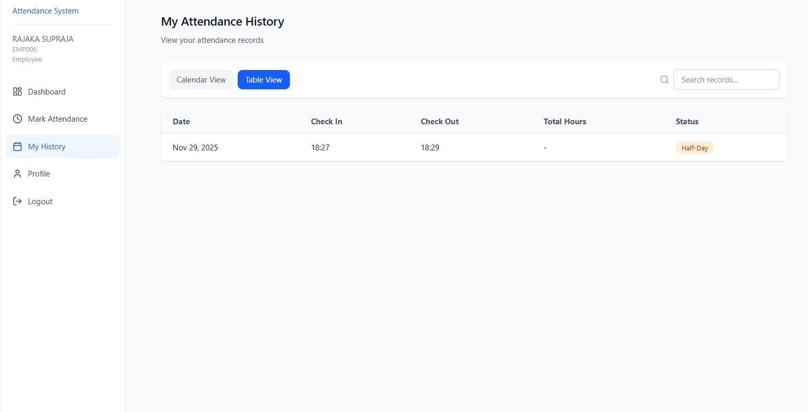
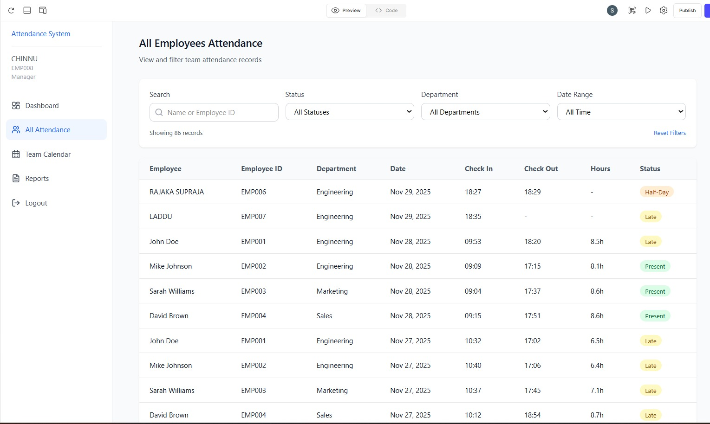
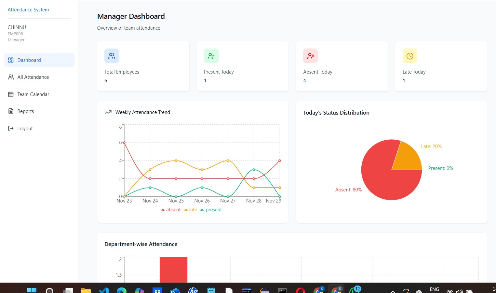
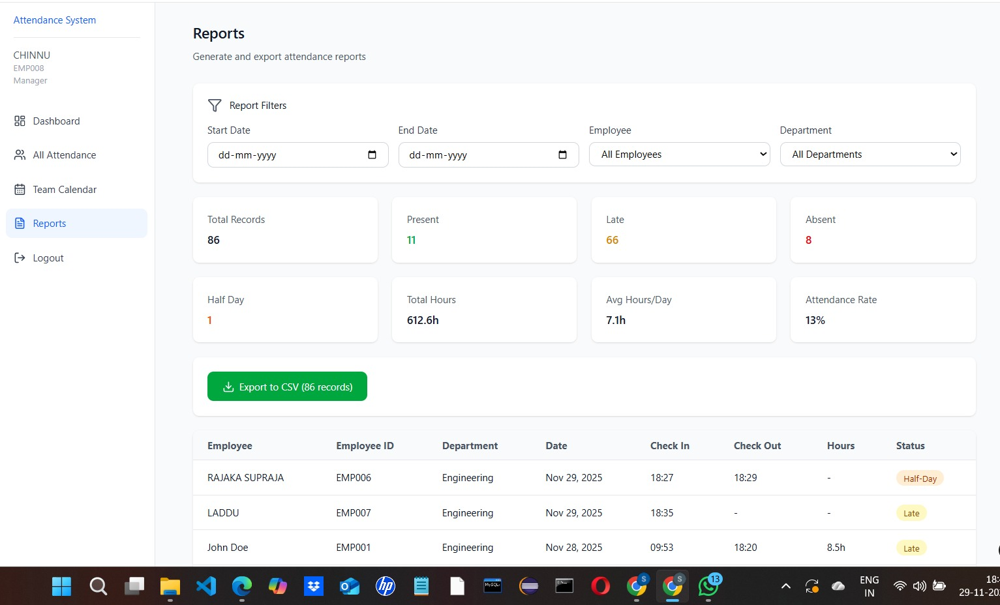

📌 Employee Attendance Management System

A full-stack MERN application that allows employees to mark attendance, view logs, and enables admins to manage employees and attendance records.

📖 Table of Contents

✨ Features

🚀 Tech Stack

📂 Project Structure

🛠️ Backend Setup (Node.js + Express)

🖥️ Frontend Setup (React)

⚙️ Environment Variables

▶️ Running the Project

📸 Screenshots

📝 API Endpoints

📄 License

✨ Features
👨‍🏫 Employee Features

Login and Register

Mark Check-In / Check-Out

View daily status

See attendance history

👨‍💼 Admin / Manager Features

Admin login

View all employees

View today’s attendance

Manage users

Dashboard analytics

🚀 Tech Stack
Frontend

React.js

Axios

React Router

Backend

Node.js

Express.js

MongoDB + Mongoose

JWT Authentication

📂 Project Structure
project-root/
│
├── backend/
│   ├── controllers/
│   ├── models/
│   ├── routes/
│   ├── middleware/
│   └── server.js
│
└── frontend/
    ├── src/
    │   ├── pages/
    │   ├── components/
    │   ├── utils/
    │   └── App.js
    └── package.json

🛠️ Backend Setup (Node.js + Express)
1️⃣ Navigate to backend folder
cd backend

2️⃣ Install dependencies
npm install

3️⃣ Add .env file

Create a .env file inside backend folder:

PORT=5000
MONGO_URI=mongodb://localhost:27017/attendanceDB
JWT_SECRET=yourStrongSecretKey

4️⃣ Start backend server
npm start

Backend runs on:
👉 http://localhost:5000

🖥️ Frontend Setup (React)
1️⃣ Navigate to frontend
cd frontend

2️⃣ Install dependencies
npm install

3️⃣ Start frontend
npm start

Frontend runs on:
👉 http://localhost:3000

⚙️ Environment Variables
Backend .env
Variable	Description
PORT	Backend port
MONGO_URI	MongoDB connection string
JWT_SECRET	Secret key for JWT
Frontend .env

Create .env inside /frontend:

REACT_APP_API_URL=http://localhost:5000/api

▶️ Running the Project
1. Start MongoDB locally
mongod

2. Start backend
cd backend
npm start

3. Start frontend
cd frontend
npm start

4. Open browser

👉 http://localhost:3000

📸 Screenshots
## 📸 Screenshots

### REGISTER

### LOGIN

### Employee Dashboard

### Employee Attendance History

### Employee Profile

### Employee Table View

### Manager Attendance

### Manager Dashboard

### Manager Reports

### Recording / Demo Video

Attendance Marking

📝 API Endpoints
Auth Routes
Method	Endpoint	Description
POST	/api/auth/register	Register employee
POST	/api/auth/login	Login user
GET	/api/auth/me	Get logged user
Attendance Routes
Method	Endpoint	Description
POST	/api/attendance/checkin	Mark check-in
POST	/api/attendance/checkout	Mark check-out
GET	/api/attendance/my	My attendance logs
Admin Routes
Method	Endpoint	Description
GET	/api/admin/employees	List all employees
GET	/api/admin/today	Today's attendance
DELETE	/api/admin/user/:id	Delete employee
📄 License

This project is free to use for educational and project submission purposes.
